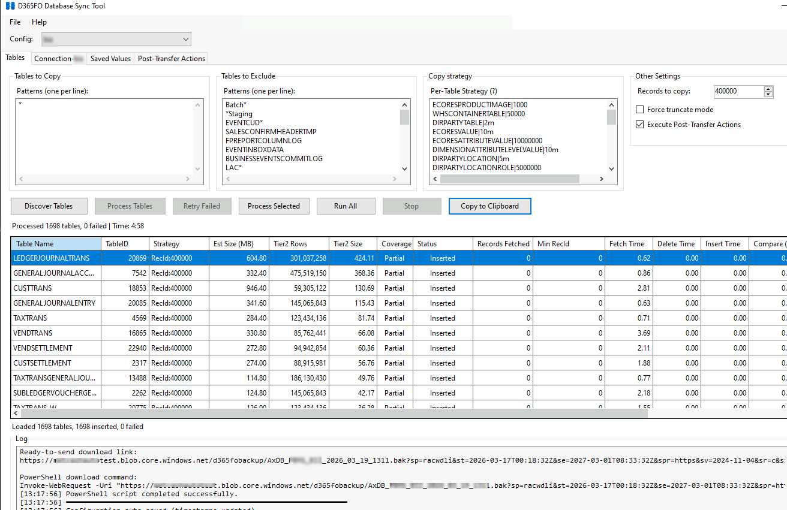
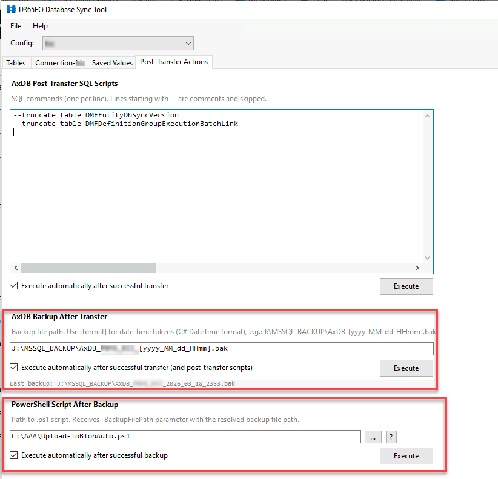

# D365FO Database Sync Tool

A WinForms .NET 9 application for synchronizing data from Dynamics 365 Finance & Operations Azure SQL Database (Tier2) to local SQL Server (AxDB).

## Overview

This tool helps developers synchronize data from D365FO cloud environments to their local development databases, making it easier to test with production-like data.

The main idea: make the last X records (ordered by RecId) the same between Tier2 and AxDB, ensuring your local environment has the most recent data from Tier2.





## Usage

### Step 1: Save Current AxDB

Before copying data, create a backup or snapshot of your current AxDB for safety:

**Option A: Create Database Snapshot (recommended for quick rollback)**
```sql
-- Create snapshot
CREATE DATABASE AxDB_MyReserveCase ON
( NAME = AxDB, FILENAME = 'E:\MSSQL_BACKUP\AxDB_MyReserveCase.ss' )
AS SNAPSHOT OF AxDB;

-- Restore from snapshot (if needed)
ALTER DATABASE AxDB SET SINGLE_USER WITH ROLLBACK IMMEDIATE;
RESTORE DATABASE AxDB FROM DATABASE_SNAPSHOT = 'AxDB_MyReserveCase';
ALTER DATABASE AxDB SET MULTI_USER;
```

**Option B: Traditional Backup**
```sql
BACKUP DATABASE AxDB TO DISK = 'E:\MSSQL_BACKUP\AxDB_Backup.bak';
```

### Step 2: Get Tier2 Connection

Two steps required to access Tier2 database:

**Step 2.1: Whitelist Your IP Address**
1. Go to LCS environment page
2. Click **Maintain** → **Enable access**
3. Enter your IP address in the dialog

**Step 2.2: Get Database Credentials**
1. In Environment page, go to **Database accounts** section
2. Choose **Reason for access** = "AX troubleshooting (read-only to AX)"
3. Click **Request access**
4. Copy database server and user credentials

**Note:** You can avoid Step 2.2 by creating a permanent read-only user in Tier2:
```sql
CREATE USER [SyncDBReader] WITH PASSWORD = 'YOUR_SECURE_PASSWORD_HERE';
EXEC sp_addrolemember N'db_datareader', N'SyncDBReader';
GRANT VIEW DATABASE PERFORMANCE STATE TO [SyncDBReader];

-- and firewall 
exec sp_set_database_firewall_rule N'SyncDBReader', '<yourIP>', '<yourIP>'
```

### Step 3: Create Local Database User

Create a user with db_owner role on your local SQL Server:
```sql
CREATE LOGIN [SyncDBReaderLocal] WITH PASSWORD = 'YourPassword';
USE AxDB;
CREATE USER [SyncDBReaderLocal] FOR LOGIN [SyncDBReaderLocal];
EXEC sp_addrolemember 'db_owner', [SyncDBReaderLocal];
```

### Step 4: Configure Application

1. **Enter Connection Details** (Connection tab):
   - Tier2: Server address, database name, username, password from Step 2
   - AxDB: localhost\AxDB, username, password from Step 3

2. **Set Tables and Strategies** (Tables tab):

**Sample Tables to Exclude:**
```
Sys*
Batch*
*Staging
EVENTCUD
SALESCONFIRMHEADERTMP
FPREPORTCOLUMNLOG
EVENTINBO*
BUSINESSEVENTSCOMMITLOG
LAC*
DOCUHISTORY
LICENSING*
DMF*
UNITOFMEASURECONVERSIONCACHE
SECURITY*
USERSEC*
USERDATAAREAFILTER
RETAILTAB*
*ARCHIVE
SRSREPORTQUERY
BUSINESSEVENTSEXCEPTIONLOG
SALESLINEDELETE
SALESTABLEDELETE
WHSWORKUSERSESSIONLOG
SMMTRANSLOG
INVENTCLOSINGLOG
WHSWORKUSERSESSIONSTATE
WHSWORKUSERSESSION
INVENTSUMDELTADIM
INVENTSUMDELTA
COSTOBJECTSTATEMENTCACHE
```

**Copy Strategy Examples:**
```
InventDim|sql: SELECT * FROM InventDim WHERE RecId IN (SELECT RecId FROM (SELECT RecId FROM InventDim WHERE LICENSEPLATEID = '' AND PARTITION = 5637144576 AND DATAAREAID = 'USMF' AND WMSLOCATIONID = '' UNION SELECT RecId FROM (SELECT TOP 50000 RecId FROM InventDim ORDER BY RecId DESC) t) u) AND @sysRowVersionFilter ORDER BY RecId DESC
InventSum|sql: SELECT * FROM InventSum WHERE Closed = 0 AND @sysRowVersionFilter ORDER BY RecId DESC
ECORESPRODUCTIMAGE|1000
WHSCONTAINERTABLE|50000
WHSINVENTRESERVE|sql: SELECT * FROM WHSINVENTRESERVE WHERE ((HIERARCHYLEVEL = 1 AND AVAILPHYSICAL <> 0) OR MODIFIEDDATETIME > DATEADD(DAY, -93, GETUTCDATE())) AND PARTITION = 5637144576 AND DATAAREAID = 'USMF' AND @sysRowVersionFilter ORDER BY RecId DESC
```

**Records to Copy:** `100000` (default record count for RecId strategy)

### Step 5: Discover Tables

1. Click **Discover Tables**
2. The system will query Tier2 and display ~data to copy
3. Click **Copy to Clipboard** to export table list to Excel
4. Review tables with large **Est Size(MB)** values
5. Check all tables that exceed **Records to Copy** threshold

By default, the system matches the last X records between AxDB and Tier2. For some tables, you may need more complex logic using SQL strategies.

### Step 6: Process Tables

1. Click **Process Tables** to start copying all discovered tables
2. The system will copy all tables to AxDB using parallel workers
3. Monitor progress in the log window
4. If a table fails, use **Process Selected** (right-click menu) to retry just that table

**Tips:**
- First run may take longer as it performs delta comparison
- Subsequent runs use INCREMENTAL mode optimization (much faster)
- Tables are processed in parallel (default: 10 workers, configurable)

### Step 7: Post-Transfer Actions (Optional)

The **Post-Transfer Actions** tab lets you configure actions that run automatically after a successful transfer. Actions execute in chain: SQL Scripts → Database Backup → PowerShell Script.

**SQL Scripts:**
1. Enter SQL commands (one per line, lines starting with `--` are skipped as comments)
2. Check **Execute automatically after successful transfer** to run on every sync
3. Or click **Execute** button to run manually

**Database Backup:**
1. Enter backup path pattern using `[format]` for date-time tokens (e.g., `J:\MSSQL_BACKUP\AxDB_[yyyy_MM_dd_HHmm].bak`)
2. Check **Execute automatically** to run after successful SQL scripts
3. Progress is polled in real-time via SQL Server DMVs

**PowerShell Script:**
1. Specify path to a `.ps1` script (use **...** button to browse)
2. The script receives `-BackupFilePath` parameter with the resolved backup path
3. Check **Execute automatically after successful backup** for auto-execution
4. Click **?** button to copy a sample script template to clipboard

**Example PowerShell script** (upload backup to Azure Blob):
```powershell
param(
    [Parameter(Mandatory=$true)]
    [string]$BackupFilePath
)
Write-Host "Uploading $BackupFilePath..."
# Copy-Item -Path $BackupFilePath -Destination "\\server\share\backups\" -Force
```

## Features

### Core Functionality
- **Selective Table Copying**: Use patterns to include/exclude tables (e.g., `CUST*`, `Sys*`)
- **Simplified Copy Strategies**:
  - **RecId Strategy**: Copy top N records by RecId DESC (e.g., `CUSTTABLE|5000`)
  - **SQL Strategy**: Custom SQL queries with placeholders (e.g., `CUSTTABLE|sql:SELECT * FROM CUSTTABLE WHERE DATAAREAID='USMF'`)
  - **Truncate Option**: Force TRUNCATE before insert with `-truncate` flag
- **SysRowVersion Optimization**: Intelligent change detection for incremental sync
  - **INCREMENTAL Mode**: Only sync changed records when changes < 40% threshold
  - **TRUNCATE Mode**: Full table refresh when changes > 40% threshold
  - **Timestamp Tracking**: Automatic persistence of sync state for future optimizations
- **Smart Field Mapping**: Automatically maps common fields between source and destination
- **Parallel Execution**: Configurable parallel workers (1-50) for concurrent table processing
- **Delta Comparison**: Smart comparison using RECVERSION + datetime fields to skip unchanged records
- **Post-Transfer Actions**: Configurable chain of actions after successful sync:
  - **SQL Scripts**: Run custom SQL commands (e.g., cleanup, index rebuild)
  - **Database Backup**: Automated backup with date-time tokens in path and real-time progress
  - **PowerShell Script**: Run a .ps1 script with backup file path as parameter (e.g., upload to blob storage)

### Strategy Syntax

**Format:**
```
TableName|RecordCount|sql:CustomQuery -truncate
```

**Examples:**
```
CUSTTABLE                    # RecId: default count
SALESLINE|10000              # RecId: top 10000
INVENTTRANS|sql:SELECT * FROM INVENTTRANS WHERE DATAAREAID='USMF' ORDER BY RecId DESC
CUSTTRANS|5000|sql:SELECT TOP (@recordCount) * FROM CUSTTRANS WHERE BLOCKED=0 ORDER BY RecId DESC
VENDTABLE|5000 -truncate     # Force truncate
```

**SQL Placeholders:**
- `*` - Replaced with actual field list (only common fields between Tier2 and AxDB)
- `@recordCount` - Replaced with record count (default or explicitly specified)
- `@sysRowVersionFilter` - Replaced with `SysRowVersion >= @Threshold AND RecId >= @MinRecId`
  - **Required for SQL strategies to enable INCREMENTAL mode optimization**
  - Without this placeholder, SQL strategies fall back to standard mode

### SysRowVersion Optimization

For tables with `SysRowVersion` column:

**First Run:**
- Standard mode with delta comparison
- Saves Tier2 and AxDB timestamps after successful sync
- Smart TRUNCATE detection: auto-enables TRUNCATE if AxDB has excess records (> 40%)

**Subsequent Runs:**
- **Control Query**: Fetches only RecId + SysRowVersion (~1KB per 1000 records vs ~100MB for full data)
- **Change Detection**: Compares timestamps to calculate change percentage
- **Mode Selection**:
  - **INCREMENTAL Mode** (changes < 40%): 3-step incremental delete + selective insert
  - **TRUNCATE Mode** (changes ≥ 40%): Full table refresh

**Benefits:**
- 99%+ reduction in data transfer when no changes detected
- 20x+ faster sync for tables with minimal changes
- Automatic fallback to full refresh when needed
- Timestamps auto-saved after each table (crash-safe)

### Technical Features
- **Automatic Sequence Updates**: Updates D365FO sequence tables after insert
- **Trigger Management**: Disables during insert, re-enables after (even on error)
- **Bulk Insert**: SqlBulkCopy with 10,000 row batches for performance
- **Transaction-based Operations**: Rollback on errors with proper cleanup
- **Connection Pooling**: Optimized for parallel execution (Max Pool Size=20)
- **Memory Efficient**: Only N tables in memory at once (where N = parallel workers)
- **Context-aware Cleanup**: Smart delete logic based on strategy and optimization mode

## Requirements

- Windows OS
- .NET 9.0 Runtime
- SQL Server 2019+ (for local AxDB)
- Access to D365FO Azure SQL Database (Tier2)

## Performance

*Actual results vary based on network, table structure, and data complexity*

Typical timings for 100k records:
- Initial synchronization: 4h
- Subsequent synchronization: 20-30 min

## Notes

- Configuration files stored in `Config/` directory (gitignored)
- Passwords obfuscated (not encrypted) using Base64
- Last used configuration tracked in `Config/.lastconfig`
- Timestamps auto-saved after each table completion
- Ensure proper database permissions before running
- Large tables may take significant time on first run (subsequent runs optimized)
- SQL queries in SQL strategy are passed directly to SQL Server - ensure proper formatting
- System Excluded Tables are combined with user-defined exclusions during execution
- For best performance, use parallel workers = number of CPU cores (default: 10, can be 20-30)
- Optimization threshold configurable per environment (default: 40%)
